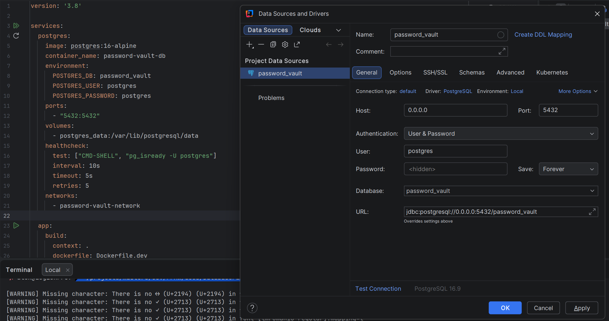
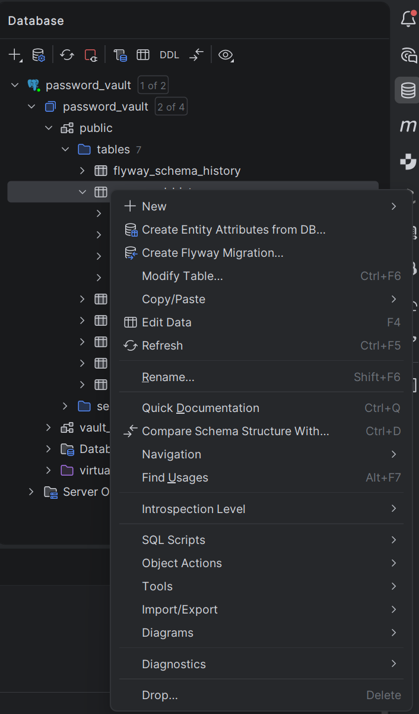
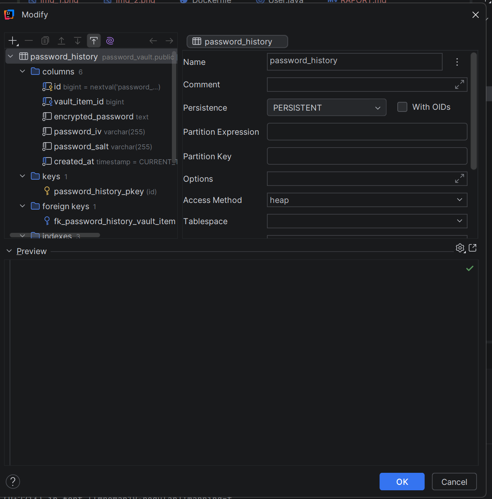

# PPAW - Laborator 2

## Arhitecturi multi-tier și proiectare aplicație

### Obiective

1. Arhitecturi multi-tier
2. Creare baza de date
3. Creare backup al bazei de date
4. Testare conexiune baza de date

---

## 1. Arhitecturi multi-tier

### Etape:

1. Restaurați baza de date.
2. Lansați în execuție aplicația AplicatieDemo_ArhitecturiMultiTier.

### Exerciții:

1. Rulați în modul Debug aplicația WinForms și urmăriți fluxul apelurilor.
2. Lansați în execuție aplicația WebForms
3. Comutați între modul de stocare SQLServer și Oracle și rulați aplicația pas cu pas. Ce date sunt afișate?

---

## 2. Creare baza de date

### Exercițiu 1

Creați tabelele corespunzătoare aplicației propuse și legăturile dintre ele și populați o parte din tabele cu date de test.

#### Conectare la baza de date

Primul pas în lucrul cu baza de date este stabilirea conexiunii. În acest laborator, am utilizat un container Docker pentru a rula PostgreSQL și am conectat aplicația la acest container.

După conectare, interfața oferă acces complet la structura bazei de date și permite gestionarea tabelelor, coloanelor și relațiilor dintre ele.

#### Gestionarea tabelelor și structurii bazei de date

Odată conectat la baza de date, am avut posibilitatea de a vizualiza, edita și adăuga tabele noi. Interfața oferă o vedere clară asupra tuturor obiectelor din schemă și permite modificări structurale.

Această funcționalitate este esențială pentru implementarea schemei bazei de date conform cerințelor aplicației, permițând crearea și modificarea tabelelor direct din mediul de dezvoltare.

#### Crearea și configurarea tabelelor

În procesul de creare a tabelelor, am definit coloanele necesare, tipurile de date corespunzătoare și constrângerile. Interfața permite:

- **Adăugarea coloanelor**: definirea numelui, tipului de date și proprietăților (NOT NULL, UNIQUE, PRIMARY KEY, etc.)
- **Editarea coloanelor existente**: modificarea tipului de date sau a proprietăților
- **Ștergerea coloanelor**: eliminarea coloanelor care nu mai sunt necesare
- **Definirea relațiilor**: crearea cheilor străine și constrângerilor între tabele

Exemplul de mai sus prezintă un tabel complet configurat, cu toate coloanele necesare, tipurile de date corecte și constrângerile aplicate. Această structură servește ca fundament pentru stocarea datelor aplicației.

---

## 3. Creare backup al bazei de date

### Exercițiu 2

Creați backup-uri ale bazei de date (logic și fizic) cu datele actuale.

#### Generarea backup-ului

După crearea și popularea tabelelor cu date de test, am generat backup-uri pentru a proteja datele și a permite restaurarea în caz de necesitate. Backup-ul poate include schema completă (structura tabelelor) și datele stocate.

Backup-ul generat conține toate informațiile necesare pentru recrearea tabelului și restaurarea datelor într-un mediu nou sau pentru sincronizarea între medii de dezvoltare.

---
## Concluzie

Acest laborator a permis familiarizarea cu:

- **Arhitectura multi-tier**: înțelegerea separării straturilor într-o aplicație
- **Gestionarea bazei de date**: crearea și configurarea tabelelor în PostgreSQL
- **Backup și restaurare**: protejarea datelor prin backup-uri regulate
- **Testarea conexiunii**: validarea comunicării cu baza de date

Aceste cunoștințe formează baza pentru dezvoltarea aplicațiilor care utilizează baze de date relaționale și arhitecturi multi-tier.

