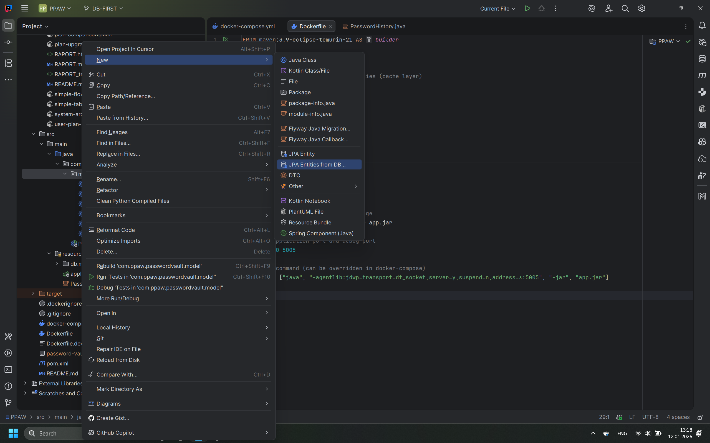
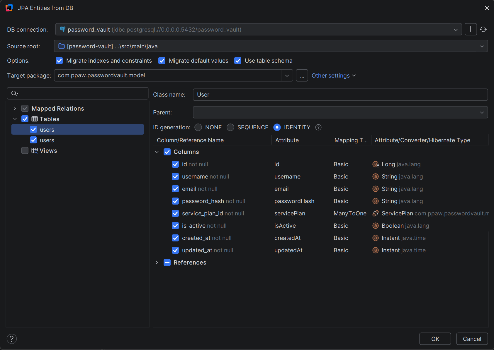
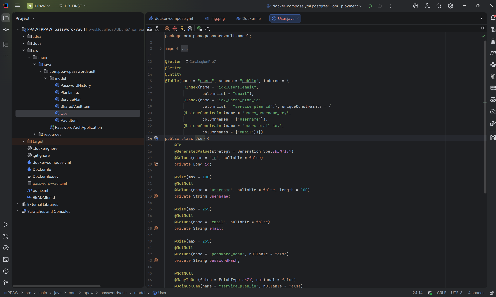

# Raport - Implementarea Database-First cu JPA Buddy

## Introducere

Acest raport descrie procesul de implementare a abordării **Database-First** în proiectul Password Vault Application, utilizând **JPA Buddy** pentru generarea automată a claselor entități JPA pe baza schemelor de bază de date create cu **Flyway**.

## Abordarea Database-First

Abordarea Database-First presupune că schema bazei de date este definită și creată primul, iar apoi clasele Java (entități JPA) sunt generate sau mapate pe baza acestei scheme. Această abordare este utilă când:
- Schema bazei de date trebuie să fie controlată precis
- Este necesar versionarea schimbărilor de schemă
- Există restricții de business care necesită control direct asupra bazei de date
- Se dorește sincronizarea perfectă între schema DB și entitățile JPA

## Arhitectura Implementării

### 1. Crearea Schemei Bazei de Date cu Flyway

Primul pas în implementarea Database-First a fost crearea și versionarea schemei bazei de date utilizând **Flyway** pentru migrații.

#### Configurarea Flyway

În `application.properties`, Flyway a fost configurat astfel:

```properties
# Flyway Configuration
spring.flyway.enabled=true
spring.flyway.baseline-on-migrate=true
spring.flyway.locations=classpath:db/migration
spring.flyway.schemas=public
```

Configurarea JPA/Hibernate pentru validare (nu generare automată):

```properties
# JPA/Hibernate Configuration
spring.jpa.hibernate.ddl-auto=validate
spring.jpa.show-sql=true
spring.jpa.properties.hibernate.dialect=org.hibernate.dialect.PostgreSQLDialect
```

Setarea `ddl-auto=validate` asigură că Hibernate nu va încerca să genereze sau modifice schema, ci doar să valideze că entitățile JPA corespund schemei existente.

#### Migrațiile Flyway

Migrațiile au fost create secvențial pentru a construi schema completă:

**V1__Create_service_plans_table.sql**
- Creează tabelele `service_plans` și `plan_limits`
- Definește relația one-to-one între planuri și limite
- Adaugă indecși pentru performanță

**V2__Create_users_table.sql**
- Creează tabela `users`
- Definește relația many-to-one cu `service_plans`
- Adaugă constrângeri pentru username și email unice

**V3__Create_vault_items_table.sql**
- Creează tabela `vault_items` pentru stocarea parolelor criptate
- Definește relația many-to-one cu `users`
- Include câmpuri pentru metadata (url, notes, folder, tags)

**V4__Create_password_history_table.sql**
- Creează tabela `password_history` pentru istoricul versiunilor de parole
- Definește relația many-to-one cu `vault_items`

**V5__Create_shared_vault_items_table.sql**
- Creează tabela `shared_vault_items` pentru funcționalitatea de partajare
- Definește relații many-to-one cu `vault_items` și `users`

**V6__Seed_initial_plans.sql**
- Populează datele inițiale pentru planurile de serviciu (Free, Usual, Premium)

### 2. Generarea Entităților JPA cu JPA Buddy

După ce schema bazei de date a fost creată și aplicată prin migrațiile Flyway, următorul pas a fost utilizarea **JPA Buddy** pentru generarea automată a claselor entități JPA.

#### Procesul de Generare cu JPA Buddy

1. **Găsirea Opțiunii de Generare**
   - În JPA Buddy, am accesat funcționalitatea **"Entity Class from Database"** care permite generarea automată a entităților pe baza schemei existente din baza de date.



2. **Configurarea și Selecția Tabelelor și Coloanelor**
   - JPA Buddy s-a conectat la baza de date PostgreSQL care conținea deja schema creată de Flyway
   - Am configurat opțiunile de generare:
     - Selecția tabelelor relevante pentru generare:
       - `service_plans`
       - `plan_limits`
       - `users`
       - `vault_items`
       - `password_history`
       - `shared_vault_items`
     - Selectarea coloanelor pentru fiecare tabel
     - Configurarea opțiunilor de generare (Lombok, validări, etc.)



3. **Generarea Entităților**
   - JPA Buddy a generat automat clasele Java cu:
     - Anotațiile JPA corecte (`@Entity`, `@Table`, `@Column`)
     - Mapping-ul corect al coloanelor (inclusiv transformarea snake_case în camelCase)
     - Relațiile JPA (`@OneToOne`, `@ManyToOne`, `@OneToMany`)
     - Anotații Lombok pentru a reduce boilerplate code (`@Getter`, `@Setter`)
     - Validări JSR-303 (`@NotNull`, `@Size`)
     - Indexuri și constrângeri unice din baza de date



#### Exemplu de Entitate Generată

**User.java** - exemplu de entitate generată de JPA Buddy:

```java
package com.ppaw.passwordvault.model;

import jakarta.persistence.*;
import jakarta.validation.constraints.NotNull;
import jakarta.validation.constraints.Size;
import lombok.Getter;
import lombok.Setter;
import org.hibernate.annotations.ColumnDefault;

import java.time.Instant;

@Getter
@Setter
@Entity
@Table(name = "users", schema = "public", indexes = {
        @Index(name = "idx_users_email",
                columnList = "email"),
        @Index(name = "idx_users_plan_id",
                columnList = "service_plan_id")}, uniqueConstraints = {
        @UniqueConstraint(name = "users_username_key",
                columnNames = {"username"}),
        @UniqueConstraint(name = "users_email_key",
                columnNames = {"email"})})
public class User {
    @Id
    @GeneratedValue(strategy = GenerationType.IDENTITY)
    @Column(name = "id", nullable = false)
    private Long id;

    @Size(max = 100)
    @NotNull
    @Column(name = "username", nullable = false, length = 100)
    private String username;

    @Size(max = 255)
    @NotNull
    @Column(name = "email", nullable = false)
    private String email;

    @Size(max = 255)
    @NotNull
    @Column(name = "password_hash", nullable = false)
    private String passwordHash;

    @NotNull
    @ManyToOne(fetch = FetchType.LAZY, optional = false)
    @JoinColumn(name = "service_plan_id", nullable = false)
    private ServicePlan servicePlan;

    @NotNull
    @ColumnDefault("true")
    @Column(name = "is_active", nullable = false)
    private Boolean isActive;

    @NotNull
    @ColumnDefault("CURRENT_TIMESTAMP")
    @Column(name = "created_at", nullable = false)
    private Instant createdAt;

    @NotNull
    @ColumnDefault("CURRENT_TIMESTAMP")
    @Column(name = "updated_at", nullable = false)
    private Instant updatedAt;


}
```

### 3. Relațiile între Entități

JPA Buddy a detectat automat și a mapat corect relațiile dintre tabele:

#### Relații One-to-One
- `ServicePlan` ↔ `PlanLimits`: relație one-to-one bidirecțională

#### Relații One-to-Many / Many-to-One
- `ServicePlan` → `User`: one-to-many (un plan poate avea mai mulți utilizatori)
- `User` → `VaultItem`: one-to-many (un utilizator poate avea mai multe item-uri în vault)
- `VaultItem` → `PasswordHistory`: one-to-many (un item poate avea mai multe versiuni în istoric)
- `VaultItem` → `SharedVaultItem`: one-to-many (un item poate fi partajat cu mai mulți utilizatori)

#### Relații Many-to-Many (prin tabelă intermediară)
- Partajarea item-urilor între utilizatori prin `SharedVaultItem`

### 4. Validarea Mapping-ului

După generarea entităților, aplicația utilizează `ddl-auto=validate` pentru a asigura că:
- Toate entitățile JPA corespund exact cu schema bazei de date
- Tipurile de date sunt compatibile
- Constraintele și relațiile sunt mapate corect

Dacă există discrepanțe, aplicația va eșua la pornire, prevenind inconsistențe între cod și bază de date.

## Fluxul Complet de Dezvoltare

```
1. Definirea Schema DB
   ↓
2. Crearea Migrațiilor Flyway (V1, V2, V3, V4, V5, V6)
   ↓
3. Executarea Migrațiilor (la pornirea aplicației)
   ↓
4. Conectarea JPA Buddy la DB
   ↓
5. Scanarea Tabelelor și Relațiilor
   ↓
6. Generarea Automată a Entităților JPA
   ↓
7. Validarea Mapping-ului (ddl-auto=validate)
   ↓
8. Utilizarea Entităților în Cod
```

## Avantaje ale Abordării Database-First cu JPA Buddy

1. **Versionare Clară**: Schema bazei de date este versionată explicit prin migrațiile Flyway
2. **Generare Rapidă**: JPA Buddy generează automat toate entitățile, economisind timp
3. **Consistență**: Asigură sincronizarea perfectă între schema DB și entități
4. **Control**: Dezvoltatorul are control complet asupra structurii bazei de date
5. **Reversibilitate**: Migrațiile Flyway permit rollback-ul schimbărilor
6. **Documentație**: Migrațiile SQL servesc ca documentație pentru schema bazei de date

## Limitări și Considerații

1. **Sincronizare Manuală**: Dacă schema se schimbă, trebuie regenerat entitățile cu JPA Buddy
2. **Dependență de Tool**: Necesită acces la JPA Buddy pentru generare
3. **Customizare Post-Generare**: După generare, pot fi necesare ajustări manuale (ex: `@PrePersist`, `@PreUpdate`)

## Concluzie

Implementarea abordării Database-First cu JPA Buddy a oferit un proces eficient și structurat pentru crearea schemei bazei de date și generarea entităților JPA. Fluxul de lucru combină versatilitatea și controlul oferit de Flyway pentru migrații cu eficiența generării automate a codului oferită de JPA Buddy, rezultând într-o arhitectură robustă și ușor de întreținut.

Proiectul beneficiază acum de:
- ✓ Schema bazei de date versionată și documentată
- ✓ Entități JPA generate automat și sincronizate cu schema
- ✓ Validare automată a consistenței la pornirea aplicației
- ✓ Baza solidă pentru dezvoltarea ulterioară

