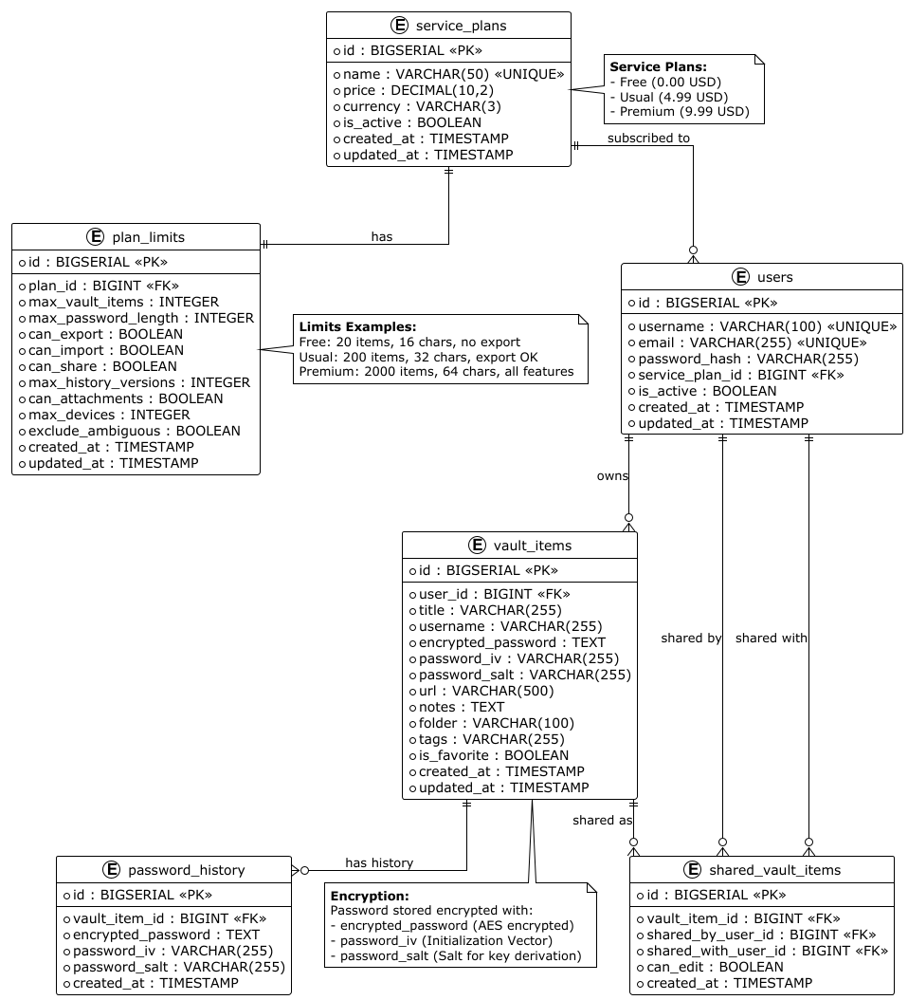
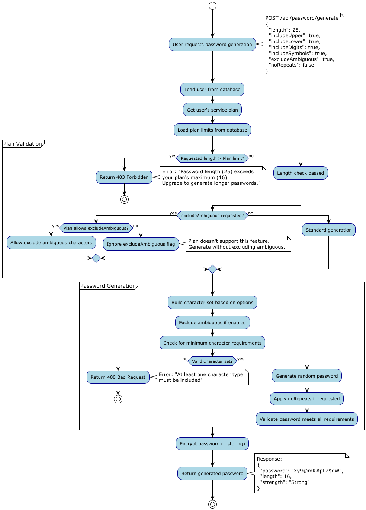
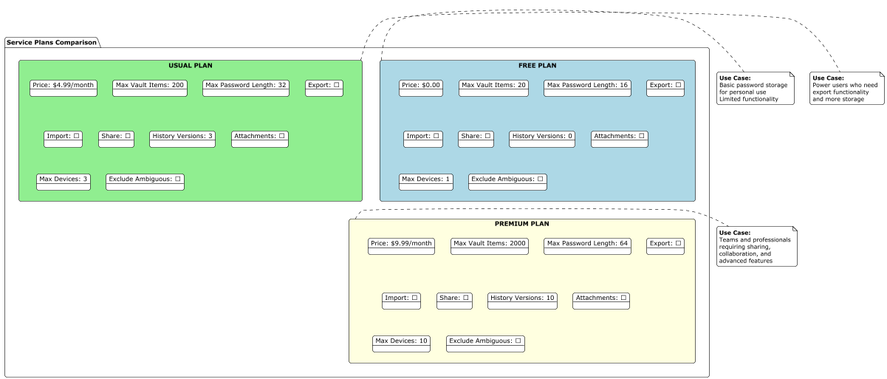

# Raport Tehnic - Aplicație Password Vault

## 1. Descrierea Aplicației

**Password Generator & Vault** este o aplicație web dezvoltată în Spring Boot pentru gestionarea securizată a parolelor, care implementează un model de monetizare bazat pe planuri de serviciu. Aplicația permite utilizatorilor să stocheze, genereze și gestioneze parole criptate într-un seif digital (vault), cu funcționalități și limitări variate în funcție de planul de abonament ales.

### Funcționalități Principale:

- **Gestionare Parole**: Stocare securizată a parolelor într-un seif criptat
- **Generator de Parole**: Generare automată de parole sigure, cu opțiuni personalizabile
- **Planuri de Serviciu**: Trei niveluri (Free, Usual, Premium) cu limitări și funcționalități diferite
- **Validare Planuri**: Sistem de validare care asigură respectarea limitărilor pentru fiecare plan
- **Istoric Parole**: Păstrarea versiunilor anterioare ale parolelor (pentru planurile superioare)
- **Partajare**: Partajare securizată a intrărilor din seif între utilizatori (funcție Premium)
- **Export/Import**: Export și import de date (disponibil pentru planurile plătite)

Aplicația este construită pe arhitectură în trei straturi (Presentation → Service → Data Access), folosind PostgreSQL ca bază de date și Flyway pentru gestionarea migrațiilor. Toate parolele sunt stocate criptat, asigurând un nivel ridicat de securitate.

---

## 2. Schema Bazei de Date



### Descrierea Schemei

Schema bazei de date a aplicației Password Vault este structurată în șase tabele principale care modelează întregul domeniu de business:

#### 2.1. **service_plans** (Planuri de Serviciu)
Tabelul central care definește cele trei planuri disponibile: Free, Usual și Premium. Conține informații despre nume, preț și statusul activ/inactiv al fiecărui plan.

**Câmpuri principale:**
- `id`: Identificator unic al planului
- `name`: Numele planului (Free, Usual, Premium)
- `price`: Prețul lunar al planului
- `currency`: Moneda (USD)
- `is_active`: Status activ/inactiv

#### 2.2. **plan_limits** (Limitări Plan)
Tabel asociat cu `service_plans` care definește toate limitările și funcționalitățile disponibile pentru fiecare plan. Aceasta include limite pentru numărul de intrări în seif, lungimea maximă a parolelor generate, precum și flaguri pentru funcționalități premium.

**Câmpuri principale:**
- `plan_id`: Legătură către planul de serviciu
- `max_vault_items`: Numărul maxim de intrări în seif (20/200/2000)
- `max_password_length`: Lungimea maximă a parolelor generate (16/32/64)
- `can_export`, `can_import`, `can_share`: Flaguri pentru funcționalități premium
- `max_history_versions`: Numărul de versiuni istorice păstrate
- `max_devices`: Numărul maxim de dispozitive permise

#### 2.3. **users** (Utilizatori)
Tabelul care stochează informațiile despre utilizatori, inclusiv planul de serviciu la care sunt abonați.

**Câmpuri principale:**
- `id`: Identificator unic al utilizatorului
- `username`: Numele de utilizator (unic)
- `email`: Adresa de email (unică)
- `password_hash`: Hash-ul parolei utilizatorului
- `service_plan_id`: Planul de serviciu curent

#### 2.4. **vault_items** (Intrări în Seif)
Tabelul principal care stochează toate parolele criptate ale utilizatorilor. Fiecare intrare reprezintă o parolă stocată pentru un serviciu/site web specific.

**Câmpuri principale:**
- `id`: Identificator unic al intrării
- `user_id`: Utilizatorul care deține intrarea
- `title`: Titlul/descrierea intrării
- `encrypted_password`: Parola criptată (TEXT)
- `password_iv`: Vector de inițializare pentru criptare
- `password_salt`: Salt pentru derivarea cheii
- `url`: URL-ul site-ului asociat
- `username`: Numele de utilizator asociat
- `notes`, `folder`, `tags`: Metadate opționale

#### 2.5. **password_history** (Istoric Parole)
Tabel care păstrează versiunile anterioare ale parolelor, permițând utilizatorilor să revină la versiuni vechi (disponibil pentru planurile Usual și Premium).

**Câmpuri principale:**
- `id`: Identificator unic
- `vault_item_id`: Legătură către intrarea din seif
- `encrypted_password`: Versiunea anterioară a parolei criptate
- `created_at`: Data când această versiune a fost creată

#### 2.6. **shared_vault_items** (Intrări Partajate)
Tabel care permite partajarea intrărilor din seif între utilizatori, o funcționalitate exclusivă pentru planul Premium.

**Câmpuri principale:**
- `id`: Identificator unic
- `vault_item_id`: Intrarea partajată
- `shared_by_user_id`: Utilizatorul care partajează
- `shared_with_user_id`: Utilizatorul cu care se partajează
- `can_edit`: Permisiune de editare pentru utilizatorul partajat

### Relații între Tabele

- **service_plans** ↔ **plan_limits**: Relație one-to-one (fiecare plan are exact o limitare)
- **service_plans** ↔ **users**: Relație one-to-many (un plan poate avea mulți utilizatori)
- **users** ↔ **vault_items**: Relație one-to-many (un utilizator poate avea multe intrări)
- **vault_items** ↔ **password_history**: Relație one-to-many (o intrare poate avea mai multe versiuni istorice)
- **vault_items** ↔ **shared_vault_items**: Relație one-to-many (o intrare poate fi partajată cu mai mulți utilizatori)

---

## 3. Fluxul de Generare și Validare a Parolelor



### Descrierea Fluxului

Acest diagramă prezintă procesul complet de generare a parolelor și validarea acestora în raport cu planul de serviciu al utilizatorului.

#### 3.1. **Inițializarea Cererii**

Procesul începe când utilizatorul face o cerere pentru generarea unei parole noi prin API (`POST /api/password/generate`), specificând opțiunile dorite:
- Lungimea parolei
- Tipurile de caractere (majuscule, minuscule, cifre, simboluri)
- Excluderea caracterelor ambigue
- Prevenirea repetării caracterelor

#### 3.2. **Încărcarea Informațiilor Utilizatorului**

Sistemul încarcă din baza de date:
- Informațiile despre utilizator
- Planul de serviciu la care este abonat
- Limitările asociate planului

#### 3.3. **Validarea Planului (Plan Validation)**

În această fază, sistemul verifică dacă cererea utilizatorului respectă limitările planului:

**Verificare Lungime:**
- Dacă lungimea cerută depășește `max_password_length` a planului → Returnează **403 Forbidden** cu mesaj de eroare
- Dacă lungimea este validă → Continuă procesul

**Verificare Funcționalități:**
- Dacă utilizatorul solicită excluderea caracterelor ambigue (`excludeAmbiguous`):
  - Verifică dacă planul permite această funcționalitate
  - Dacă da → Aplică excluderea
  - Dacă nu → Ignoră opțiunea și generează fără excludere

#### 3.4. **Generarea Parolei (Password Generation)**

După validare, sistemul:
1. Construiește setul de caractere bazat pe opțiunile utilizatorului
2. Aplică excluderea caracterelor ambigue (dacă este permisă)
3. Verifică că cel puțin un tip de caracter este inclus
4. Generează parola aleatorie folosind algoritmi criptografici siguri
5. Aplică restricțiile de non-repetare (dacă solicitat)
6. Validează că parola generată îndeplinește toate cerințele

#### 3.5. **Returnarea Rezultatului**

Dacă toate validările trec:
- Parola este generată cu succes
- Dacă utilizatorul dorește să o salveze, parola este criptată și stocată în seif
- Sistemul returnează parola generată (și informații despre puterea acesteia)

**Exemplu de răspuns:**
```json
{
  "password": "Xy9@mK#pL2$qW",
  "length": 16,
  "strength": "Strong"
}
```

### Scenarii de Eroare

1. **403 Forbidden**: Lungimea solicitată depășește limita planului
2. **400 Bad Request**: Setul de caractere nu este valid (toate tipurile sunt dezactivate)

Acest flux asigură că utilizatorii pot genera doar parole care se încadrează în limitările planului lor, încurajând upgrade-ul către planuri superioare pentru funcționalități avansate.

---

## 4. Comparația Planurilor de Serviciu



### Descrierea Planurilor

Diagrama prezintă o comparație vizuală între cele trei planuri de serviciu disponibile, evidențiind diferențele de limitări și funcționalități.

#### 4.1. **Free Plan (Plan Gratuit)**

Planul de bază, disponibil gratuit pentru toți utilizatorii.

**Limitări și Caracteristici:**
- **Preț**: $0.00 (gratuit)
- **Max Vault Items**: 20 intrări în seif
- **Max Password Length**: 16 caractere
- **Export**: ❌ Nu este disponibil
- **Import**: ❌ Nu este disponibil
- **Share**: ❌ Nu este disponibil
- **History Versions**: 0 (nu păstrează istoric)
- **Attachments**: ❌ Nu este disponibil
- **Max Devices**: 1 dispozitiv
- **Exclude Ambiguous**: ❌ Nu este disponibil

**Cazuri de Utilizare:**
- Utilizatori personali care au nevoie de o soluție de bază pentru gestionarea unui număr mic de parole
- Perfect pentru începători care doresc să testeze aplicația înainte de upgrade

#### 4.2. **Usual Plan (Plan Standard)**

Planul intermediar, orientat către utilizatori care necesită mai multe funcționalități.

**Limitări și Caracteristici:**
- **Preț**: $4.99/lună
- **Max Vault Items**: 200 intrări în seif (10x față de Free)
- **Max Password Length**: 32 caractere (dublu față de Free)
- **Export**: ✅ Disponibil (CSV/JSON)
- **Import**: ❌ Nu este disponibil
- **Share**: ❌ Nu este disponibil
- **History Versions**: 3 versiuni istorice
- **Attachments**: ❌ Nu este disponibil
- **Max Devices**: 3 dispozitive
- **Exclude Ambiguous**: ✅ Disponibil

**Cazuri de Utilizare:**
- Utilizatori avansați care gestionează un număr mare de conturi online
- Utilizatori care necesită funcționalitatea de export pentru backup-uri
- Persoane care doresc să genereze parole mai lungi și mai sigure

#### 4.3. **Premium Plan (Plan Premium)**

Planul complet, cu toate funcționalitățile disponibile.

**Limitări și Caracteristici:**
- **Preț**: $9.99/lună
- **Max Vault Items**: 2000 intrări în seif (100x față de Free)
- **Max Password Length**: 64 caractere (4x față de Free)
- **Export**: ✅ Disponibil
- **Import**: ✅ Disponibil
- **Share**: ✅ Disponibil (funcționalitate colaborativă)
- **History Versions**: 10 versiuni istorice
- **Attachments**: ✅ Disponibil (stocare fișiere asociate)
- **Max Devices**: 10 dispozitive
- **Exclude Ambiguous**: ✅ Disponibil

**Cazuri de Utilizare:**
- Echipe mici care doresc să partajeze parole între membri
- Profesioniști care gestionează sute de conturi
- Utilizatori care necesită sincronizare pe multiple dispozitive
- Organizații care necesită colaborare și partajare securizată

### Strategia de Monetizare

Modelul de planuri implementează o strategie de monetizare progresivă:

1. **Free Plan** servește ca "try before you buy" - permite utilizatorilor să testeze aplicația cu limitări clare
2. **Usual Plan** atrage utilizatori care au depășit limitările planului gratuit
3. **Premium Plan** oferă funcționalități colaborative care justifică prețul mai mare

Fiecare plan este optimizat pentru a oferi valoare corespunzătoare prețului, încurajând upgrade-ul natural pe măsură ce utilizatorii devin mai dependenți de serviciu.

---

## 5. Concluzii

Aplicația **Password Generator & Vault** implementează un sistem complet de gestionare a parolelor cu un model de monetizare clar și bine structurat. Prin separarea funcționalităților pe trei niveluri de planuri, aplicația oferă:

- **Accesibilitate**: Planul gratuit permite oricui să înceapă să folosească aplicația
- **Scalabilitate**: Planurile plătite oferă soluții pentru utilizatori avansați și echipe
- **Securitate**: Toate parolele sunt stocate criptat, asigurând protecție împotriva accesului neautorizat
- **Flexibilitate**: Sistemul de validare a planurilor permite extinderea ușoară a funcționalităților viitoare

Arhitectura în trei straturi asigură separarea clară a responsabilităților, facilitând mentenanța și extinderea aplicației în viitor.

