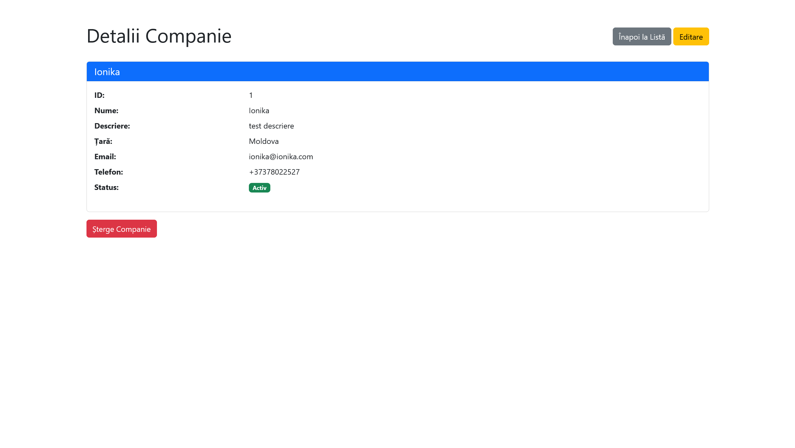
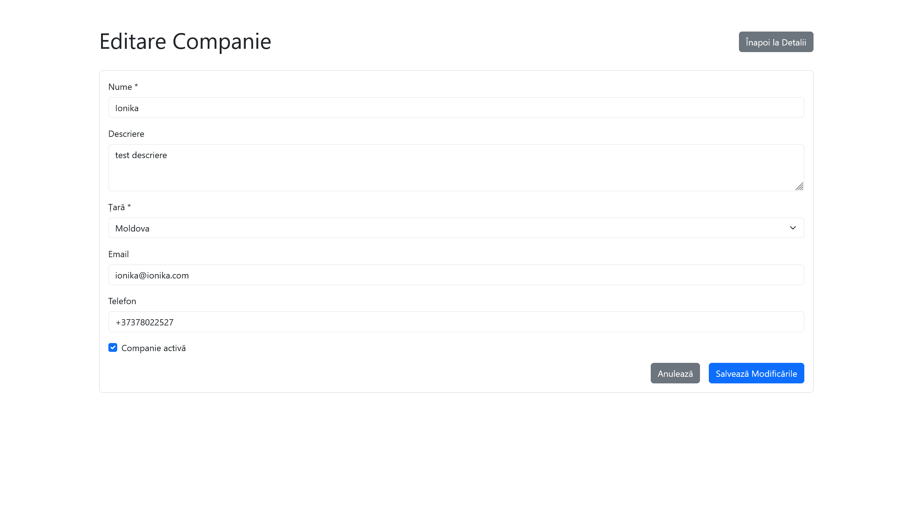
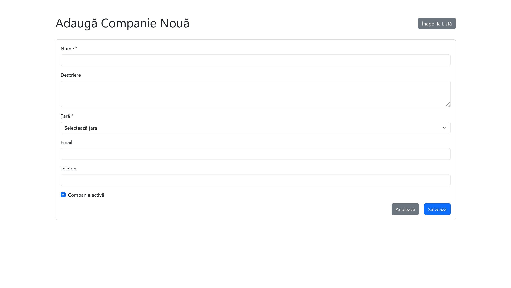
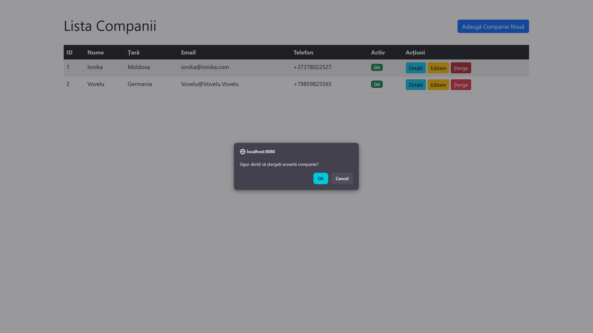
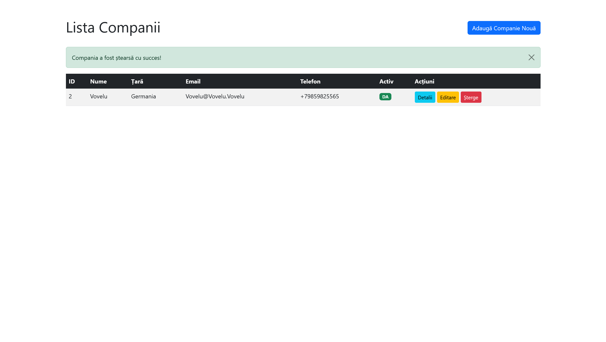

# Laborator 5 – PPAW – MVC cu Spring Boot
## Raport de Implementare

---

## Task 1 – Creare Proiect

### Dependențe adăugate în pom.xml

Proiectul Spring Boot include următoarele dependențe:

```xml
<!-- Spring Boot Web -->
<dependency>
    <groupId>org.springframework.boot</groupId>
    <artifactId>spring-boot-starter-web</artifactId>
</dependency>

<!-- Thymeleaf -->
<dependency>
    <groupId>org.springframework.boot</groupId>
    <artifactId>spring-boot-starter-thymeleaf</artifactId>
</dependency>

<!-- Spring Boot Data JPA -->
<dependency>
    <groupId>org.springframework.boot</groupId>
    <artifactId>spring-boot-starter-data-jpa</artifactId>
</dependency>

<!-- PostgreSQL Driver -->
<dependency>
    <groupId>org.postgresql</groupId>
    <artifactId>postgresql</artifactId>
    <scope>runtime</scope>
</dependency>

<!-- Validation -->
<dependency>
    <groupId>org.springframework.boot</groupId>
    <artifactId>spring-boot-starter-validation</artifactId>
</dependency>
```

**Observație**: Thymeleaf a fost adăugat pentru suportul template-urilor MVC.

---

## Task 2 – Configurare Baza de Date

### application.properties

Configurația bazei de date este definită în `src/main/resources/application.properties`:

```properties
# Database Configuration
spring.datasource.url=jdbc:postgresql://localhost:5432/password_vault
spring.datasource.username=postgres
spring.datasource.password=postgres
spring.datasource.driver-class-name=org.postgresql.Driver

# JPA/Hibernate Configuration
spring.jpa.hibernate.ddl-auto=validate
spring.jpa.show-sql=true
spring.jpa.properties.hibernate.dialect=org.hibernate.dialect.PostgreSQLDialect
spring.jpa.properties.hibernate.default_schema=vault_schema
spring.jpa.properties.hibernate.format_sql=true

# Flyway Configuration
spring.flyway.enabled=true
spring.flyway.schemas=vault_schema
spring.flyway.locations=classpath:db/migration
```

**Echivalență**: Aceasta înlocuiește `web.config` cu `connectionStrings` din ASP.NET MVC.

---

## Task 3 – Entitate + ViewModel

### 3.1 Entitatea Company

**Company.java** - `src/main/java/com/ppaw/passwordvault/model/Company.java`:

```java
@Entity
@Table(name = "companies", schema = "vault_schema")
@Data
@NoArgsConstructor
@AllArgsConstructor
public class Company {

    @Id
    @GeneratedValue(strategy = GenerationType.IDENTITY)
    private Long id;

    @Column(nullable = false, length = 100)
    private String name;

    @Column(length = 255)
    private String description;

    @Column(nullable = false, length = 50)
    private String country; // Câmp select

    @Column(nullable = false)
    private Boolean isActive = true; // Checkbox

    @Column(length = 100)
    private String email;

    @Column(length = 20)
    private String phone;

    @Column(nullable = false, updatable = false)
    private LocalDateTime createdAt;

    @Column(nullable = false)
    private LocalDateTime updatedAt;

    @PrePersist
    protected void onCreate() {
        createdAt = LocalDateTime.now();
        updatedAt = LocalDateTime.now();
    }

    @PreUpdate
    protected void onUpdate() {
        updatedAt = LocalDateTime.now();
    }
}
```

**Caracteristici:**
- ✅ Câmpuri text (String): `name`, `description`, `email`, `phone`
- ✅ Câmp select: `country` (String)
- ✅ Checkbox: `isActive` (Boolean)

### 3.2 CompanyViewModel (DTO pentru form-uri)

**CompanyViewModel.java** - `src/main/java/com/ppaw/passwordvault/dto/CompanyViewModel.java`:

```java
@Data
@NoArgsConstructor
@AllArgsConstructor
public class CompanyViewModel {

    private Long id;

    @NotBlank(message = "Numele este obligatoriu")
    @Size(max = 100, message = "Numele nu poate depăși 100 de caractere")
    private String name;

    @Size(max = 255, message = "Descrierea nu poate depăși 255 de caractere")
    private String description;

    @NotBlank(message = "Țara este obligatorie")
    @Size(max = 50, message = "Țara nu poate depăși 50 de caractere")
    private String country; // Câmp select

    private Boolean isActive = true; // Checkbox

    @Email(message = "Email-ul trebuie să fie valid")
    @Size(max = 100, message = "Email-ul nu poate depăși 100 de caractere")
    private String email;

    @Size(max = 20, message = "Telefonul nu poate depăși 20 de caractere")
    private String phone;
}
```

**Observație**: ViewModel-ul este folosit pentru form-uri și include validări Bean Validation.

---

## Task 4 – Repository

### CompanyRepository

**CompanyRepository.java** - `src/main/java/com/ppaw/passwordvault/repository/CompanyRepository.java`:

```java
@Repository
public interface CompanyRepository extends JpaRepository<Company, Long> {
    
    List<Company> findByIsActive(Boolean isActive);
    
    List<Company> findByCountry(String country);
}
```

**Echivalență**: Acesta înlocuiește `NivelAccesDate` / `Accesor` din ASP.NET MVC. JpaRepository oferă metodele standard CRUD.

---

## Task 5 – Service

### CompanyService

**CompanyService.java** - `src/main/java/com/ppaw/passwordvault/service/CompanyService.java`:

```java
@Service
@RequiredArgsConstructor
@Transactional(readOnly = true)
public class CompanyService {

    private final CompanyRepository companyRepository;

    public List<CompanyViewModel> getAll() {
        return companyRepository.findAll().stream()
                .map(this::toViewModel)
                .collect(Collectors.toList());
    }

    public CompanyViewModel getById(Long id) {
        Company company = companyRepository.findById(id)
                .orElseThrow(() -> new ResourceNotFoundException("Company", id));
        return toViewModel(company);
    }

    @Transactional
    public CompanyViewModel create(CompanyViewModel viewModel) {
        Company company = toEntity(viewModel);
        Company saved = companyRepository.save(company);
        return toViewModel(saved);
    }

    @Transactional
    public CompanyViewModel update(Long id, CompanyViewModel viewModel) {
        Company company = companyRepository.findById(id)
                .orElseThrow(() -> new ResourceNotFoundException("Company", id));
        
        company.setName(viewModel.getName());
        company.setDescription(viewModel.getDescription());
        company.setCountry(viewModel.getCountry());
        company.setIsActive(viewModel.getIsActive() != null ? viewModel.getIsActive() : true);
        company.setEmail(viewModel.getEmail());
        company.setPhone(viewModel.getPhone());
        
        Company updated = companyRepository.save(company);
        return toViewModel(updated);
    }

    @Transactional
    public void delete(Long id) {
        Company company = companyRepository.findById(id)
                .orElseThrow(() -> new ResourceNotFoundException("Company", id));
        companyRepository.delete(company);
    }

    private CompanyViewModel toViewModel(Company company) {
        CompanyViewModel viewModel = new CompanyViewModel();
        viewModel.setId(company.getId());
        viewModel.setName(company.getName());
        viewModel.setDescription(company.getDescription());
        viewModel.setCountry(company.getCountry());
        viewModel.setIsActive(company.getIsActive());
        viewModel.setEmail(company.getEmail());
        viewModel.setPhone(company.getPhone());
        return viewModel;
    }

    private Company toEntity(CompanyViewModel viewModel) {
        Company company = new Company();
        company.setName(viewModel.getName());
        company.setDescription(viewModel.getDescription());
        company.setCountry(viewModel.getCountry());
        company.setIsActive(viewModel.getIsActive() != null ? viewModel.getIsActive() : true);
        company.setEmail(viewModel.getEmail());
        company.setPhone(viewModel.getPhone());
        return company;
    }
}
```

**Metode implementate:**
- ✅ `getAll()` - Listează toate companiile
- ✅ `getById(id)` - Obține o companie după ID
- ✅ `create(dto)` - Creează o companie nouă (echivalent `AddEntity`)
- ✅ `update(id, dto)` - Actualizează o companie (echivalent `UpdateEntity`)

---

## Task 6 – Controller + Index & Details

### CompanyController

**CompanyController.java** - `src/main/java/com/ppaw/passwordvault/controller/mvc/CompanyController.java`:

```java
@Controller
@RequestMapping("/companies")
@RequiredArgsConstructor
public class CompanyController {

    private final CompanyService companyService;

    private static final List<String> COUNTRIES = Arrays.asList(
        "România", "Moldova", "Statele Unite", "Marea Britanie", 
        "Franța", "Germania", "Italia", "Spania", "Altele"
    );

    /**
     * GET /companies - Index
     * Echivalent Index() din ASP.NET MVC
     */
    @GetMapping
    public String index(Model model) {
        List<CompanyViewModel> companies = companyService.getAll();
        model.addAttribute("companies", companies);
        return "companies/index";
    }

    /**
     * GET /companies/{id} - Details
     * Echivalent Details(int id) din ASP.NET MVC
     */
    @GetMapping("/{id}")
    public String details(@PathVariable Long id, Model model) {
        CompanyViewModel company = companyService.getById(id);
        model.addAttribute("company", company);
        return "companies/details";
    }
}
```

**Observații:**
- ✅ Folosește `@Controller` (nu `@RestController`) pentru a returna view-uri Thymeleaf
- ✅ Metodele returnează `String` cu numele template-ului
- ✅ `Model` este folosit pentru a pasa date către view

---

## Task 7 – View-uri Thymeleaf pentru Index & Details

### 7.1 Index View

**index.html** - `src/main/resources/templates/companies/index.html`:

```html
<!DOCTYPE html>
<html xmlns:th="http://www.thymeleaf.org">
<head>
    <meta charset="UTF-8">
    <title>Companii - Index</title>
    <link href="https://cdn.jsdelivr.net/npm/bootstrap@5.3.0/dist/css/bootstrap.min.css" rel="stylesheet">
</head>
<body>
    <div class="container mt-5">
        <div class="d-flex justify-content-between align-items-center mb-4">
            <h1>Lista Companii</h1>
            <a th:href="@{/companies/create}" class="btn btn-primary">Adaugă Companie Nouă</a>
        </div>

        <div class="table-responsive">
            <table class="table table-striped table-hover">
                <thead class="table-dark">
                    <tr>
                        <th>ID</th>
                        <th>Nume</th>
                        <th>Țară</th>
                        <th>Email</th>
                        <th>Telefon</th>
                        <th>Activ</th>
                        <th>Acțiuni</th>
                    </tr>
                </thead>
                <tbody>
                    <tr th:if="${companies == null or companies.isEmpty()}">
                        <td colspan="7" class="text-center">Nu există companii în baza de date.</td>
                    </tr>
                    <tr th:each="company : ${companies}">
                        <td th:text="${company.id}"></td>
                        <td th:text="${company.name}"></td>
                        <td th:text="${company.country}"></td>
                        <td th:text="${company.email ?: '-'}"></td>
                        <td th:text="${company.phone ?: '-'}"></td>
                        <td>
                            <span class="badge" 
                                  th:classappend="${company.isActive} ? 'bg-success' : 'bg-secondary'"
                                  th:text="${company.isActive} ? 'DA' : 'NU'">
                            </span>
                        </td>
                        <td>
                            <a th:href="@{/companies/{id}(id=${company.id})}" class="btn btn-sm btn-info">Detalii</a>
                            <a th:href="@{/companies/{id}/edit(id=${company.id})}" class="btn btn-sm btn-warning">Editare</a>
                        </td>
                    </tr>
                </tbody>
            </table>
        </div>
    </div>
</body>
</html>
```

**Captură ecran - Pagina Index:**

Această imagine prezintă interfața paginii de listare (Index) cu toate companiile afișate în format tabelar. Se poate observa structura Bootstrap cu tabel responsive, butonul "Adaugă Companie Nouă" și coloanele pentru ID, Nume, Țară, Email, Telefon, Status și Acțiuni (Detalii, Editare, Șterge).



### 7.2 Details View

**details.html** - `src/main/resources/templates/companies/details.html`:

```html
<!DOCTYPE html>
<html xmlns:th="http://www.thymeleaf.org">
<head>
    <meta charset="UTF-8">
    <title>Detalii Companie</title>
    <link href="https://cdn.jsdelivr.net/npm/bootstrap@5.3.0/dist/css/bootstrap.min.css" rel="stylesheet">
</head>
<body>
    <div class="container mt-5">
        <h1>Detalii Companie</h1>

        <div class="card">
            <div class="card-header bg-primary text-white">
                <h5 class="mb-0" th:text="${company.name}"></h5>
            </div>
            <div class="card-body">
                <dl class="row">
                    <dt class="col-sm-3">ID:</dt>
                    <dd class="col-sm-9" th:text="${company.id}"></dd>

                    <dt class="col-sm-3">Nume:</dt>
                    <dd class="col-sm-9" th:text="${company.name}"></dd>

                    <dt class="col-sm-3">Descriere:</dt>
                    <dd class="col-sm-9" th:text="${company.description ?: '-'}"></dd>

                    <dt class="col-sm-3">Țară:</dt>
                    <dd class="col-sm-9" th:text="${company.country}"></dd>

                    <dt class="col-sm-3">Email:</dt>
                    <dd class="col-sm-9" th:text="${company.email ?: '-'}"></dd>

                    <dt class="col-sm-3">Telefon:</dt>
                    <dd class="col-sm-9" th:text="${company.phone ?: '-'}"></dd>

                    <dt class="col-sm-3">Status:</dt>
                    <dd class="col-sm-9">
                        <span class="badge" 
                              th:classappend="${company.isActive} ? 'bg-success' : 'bg-secondary'"
                              th:text="${company.isActive} ? 'Activ' : 'Inactiv'">
                        </span>
                    </dd>
                </dl>
            </div>
        </div>
    </div>
</body>
</html>
```

**Captură ecran - Pagina Details:**

Această imagine prezintă pagina de detalii a unei companii, unde toate informațiile sunt afișate într-un card Bootstrap. Se observă structura cu Definition List (`<dl>`) care organizează informațiile în perechi label-valoare, precum și badge-ul pentru statusul activ/inactiv al companiei.



**Caracteristici Thymeleaf:**
- `th:text` - Afișare text
- `th:each` - Iterare peste colecții
- `th:href` - Link-uri dinamice
- `th:if` - Condiții
- `th:object` / `th:field` - Binding form-uri

---

## Task 8 – Create (GET + POST)

### 8.1 Controller - Create

```java
/**
 * GET /companies/create - Afișare formular creare
 */
@GetMapping("/create")
public String createForm(Model model) {
    model.addAttribute("company", new CompanyViewModel());
    model.addAttribute("countries", COUNTRIES);
    return "companies/create";
}

/**
 * POST /companies/create - Salvare companie nouă
 */
@PostMapping("/create")
public String create(@Valid @ModelAttribute("company") CompanyViewModel companyViewModel,
                    BindingResult bindingResult,
                    Model model,
                    RedirectAttributes redirectAttributes) {
    if (bindingResult.hasErrors()) {
        model.addAttribute("countries", COUNTRIES);
        return "companies/create";
    }
    
    CompanyViewModel saved = companyService.create(companyViewModel);
    redirectAttributes.addFlashAttribute("successMessage", "Compania a fost creată cu succes!");
    return "redirect:/companies/" + saved.getId();
}
```

### 8.2 Create View

**create.html** - `src/main/resources/templates/companies/create.html`:

```html
<!DOCTYPE html>
<html xmlns:th="http://www.thymeleaf.org">
<head>
    <meta charset="UTF-8">
    <title>Adaugă Companie</title>
    <link href="https://cdn.jsdelivr.net/npm/bootstrap@5.3.0/dist/css/bootstrap.min.css" rel="stylesheet">
</head>
<body>
    <div class="container mt-5">
        <h1>Adaugă Companie Nouă</h1>

        <form th:action="@{/companies/create}" th:object="${company}" method="post">
            <!-- Nume -->
            <div class="mb-3">
                <label for="name" class="form-label">Nume *</label>
                <input type="text" class="form-control" id="name" th:field="*{name}" 
                       th:classappend="${#fields.hasErrors('name')} ? 'is-invalid'">
                <div th:if="${#fields.hasErrors('name')}" class="invalid-feedback">
                    <span th:errors="*{name}"></span>
                </div>
            </div>

            <!-- Descriere -->
            <div class="mb-3">
                <label for="description" class="form-label">Descriere</label>
                <textarea class="form-control" id="description" th:field="*{description}" rows="3"></textarea>
            </div>

            <!-- Țară (Select) -->
            <div class="mb-3">
                <label for="country" class="form-label">Țară *</label>
                <select class="form-select" id="country" th:field="*{country}">
                    <option value="">Selectează țara</option>
                    <option th:each="country : ${countries}" 
                            th:value="${country}" 
                            th:text="${country}">
                    </option>
                </select>
            </div>

            <!-- Email -->
            <div class="mb-3">
                <label for="email" class="form-label">Email</label>
                <input type="email" class="form-control" id="email" th:field="*{email}">
            </div>

            <!-- Telefon -->
            <div class="mb-3">
                <label for="phone" class="form-label">Telefon</label>
                <input type="text" class="form-control" id="phone" th:field="*{phone}">
            </div>

            <!-- Checkbox Activ -->
            <div class="mb-3 form-check">
                <input type="checkbox" class="form-check-input" id="isActive" th:field="*{isActive}">
                <label class="form-check-label" for="isActive">
                    Companie activă
                </label>
            </div>

            <button type="submit" class="btn btn-primary">Salvează</button>
        </form>
    </div>
</body>
</html>
```

**Caracteristici:**
- ✅ Formular cu validare (`@Valid`)
- ✅ Câmp select pentru țară
- ✅ Checkbox pentru status activ
- ✅ Afișare erori de validare

**Captură ecran - Pagina Create:**

Această imagine prezintă formularul de creare a unei companii noi. Se observă toate câmpurile din formular: Nume (text, obligatoriu), Descriere (textarea), Țară (dropdown select), Email (cu validare), Telefon (text) și checkbox-ul pentru status activ. Formularul folosește Bootstrap pentru styling și Thymeleaf pentru binding-ul datelor.



---

## Task 9 – Edit (GET + POST)

### 9.1 Controller - Edit

```java
/**
 * GET /companies/{id}/edit - Afișare formular editare
 */
@GetMapping("/{id}/edit")
public String editForm(@PathVariable Long id, Model model) {
    CompanyViewModel company = companyService.getById(id);
    model.addAttribute("company", company);
    model.addAttribute("countries", COUNTRIES);
    return "companies/edit";
}

/**
 * POST /companies/{id}/edit - Salvare modificări
 */
@PostMapping("/{id}/edit")
public String update(@PathVariable Long id,
                    @Valid @ModelAttribute("company") CompanyViewModel companyViewModel,
                    BindingResult bindingResult,
                    Model model,
                    RedirectAttributes redirectAttributes) {
    if (bindingResult.hasErrors()) {
        model.addAttribute("countries", COUNTRIES);
        return "companies/edit";
    }
    
    CompanyViewModel updated = companyService.update(id, companyViewModel);
    redirectAttributes.addFlashAttribute("successMessage", "Compania a fost actualizată cu succes!");
    return "redirect:/companies/" + updated.getId();
}
```

### 9.2 Edit View

**edit.html** - `src/main/resources/templates/companies/edit.html`:

```html
<!DOCTYPE html>
<html xmlns:th="http://www.thymeleaf.org">
<head>
    <meta charset="UTF-8">
    <title>Editare Companie</title>
    <link href="https://cdn.jsdelivr.net/npm/bootstrap@5.3.0/dist/css/bootstrap.min.css" rel="stylesheet">
</head>
<body>
    <div class="container mt-5">
        <h1>Editare Companie</h1>

        <form th:action="@{/companies/{id}/edit(id=${company.id})}" th:object="${company}" method="post">
            <!-- ID (hidden) -->
            <input type="hidden" th:field="*{id}">

            <!-- Același formular ca la create, dar cu date pre-populate -->
            <div class="mb-3">
                <label for="name" class="form-label">Nume *</label>
                <input type="text" class="form-control" id="name" th:field="*{name}">
            </div>

            <!-- ... alte câmpuri ... -->

            <button type="submit" class="btn btn-primary">Salvează Modificările</button>
        </form>
    </div>
</body>
</html>
```

**Observație**: Formularul este similar cu create, dar datele sunt pre-populate din baza de date.

**Captură ecran - Pagina Edit:**

Această imagine prezintă formularul de editare a unei companii existente. Se observă că toate câmpurile sunt pre-populate cu datele existente din baza de date. ID-ul companiei este transmis ca câmp hidden, iar formularul permite modificarea tuturor câmpurilor. Validările funcționează la fel ca la creare.



---

## Task 10 – Testare

### 10.1 Rulare Aplicație

```bash
mvn spring-boot:run
```

Sau prin Docker Compose:
```bash
docker-compose up
```

**Arhitectură MVC - Flux de date:**

Această diagramă ilustrează arhitectura MVC și fluxul de date între componente. Request-ul vine de la browser, este procesat de Controller, care apelează Service pentru logică de business, Service folosește Repository pentru acces la baza de date, iar răspunsul este returnat sub formă de view Thymeleaf către utilizator.


### 10.2 Endpoint-uri Testate

1. **Index**: `http://localhost:8080/companies`
   - Listează toate companiile

2. **Details**: `http://localhost:8080/companies/{id}`
   - Afișează detalii despre o companie

3. **Create (GET)**: `http://localhost:8080/companies/create`
   - Afișează formularul de creare

4. **Create (POST)**: `http://localhost:8080/companies/create`
   - Salvează compania nouă

5. **Edit (GET)**: `http://localhost:8080/companies/{id}/edit`
   - Afișează formularul de editare cu date pre-populate

6. **Edit (POST)**: `http://localhost:8080/companies/{id}/edit`
   - Salvează modificările

### 10.3 Funcționalități Testate

✅ **Listare**: Toate companiile sunt afișate în tabel  
✅ **Detalii**: Detaliile unei companii sunt afișate corect  
✅ **Creare**: Formularul de creare funcționează, validările funcționează  
✅ **Editare**: Formularul de editare pre-populează datele corect  
✅ **Validare**: Erorile de validare sunt afișate corect  
✅ **Redirect**: Redirect-ul după create/edit funcționează  

---

## Task 11 – Fișiere de Predat

### 11.1 Entitate + DTO

**Fișiere:**
- `src/main/java/com/ppaw/passwordvault/model/Company.java` - Entitatea JPA
- `src/main/java/com/ppaw/passwordvault/dto/CompanyViewModel.java` - ViewModel pentru form-uri

### 11.2 Controller

**Fișier:**
- `src/main/java/com/ppaw/passwordvault/controller/mvc/CompanyController.java` - MVC Controller

### 11.3 Repository (și Service)

**Fișiere:**
- `src/main/java/com/ppaw/passwordvault/repository/CompanyRepository.java` - Repository
- `src/main/java/com/ppaw/passwordvault/service/CompanyService.java` - Service

### 11.4 View-uri Thymeleaf

**Fișiere:**
- `src/main/resources/templates/companies/index.html` - Listare
- `src/main/resources/templates/companies/details.html` - Detalii
- `src/main/resources/templates/companies/create.html` - Creare
- `src/main/resources/templates/companies/edit.html` - Editare

### 11.5 Migrație Baza de Date

**Fișier:**
- `src/main/resources/db/migration/V11__20241201_create_companies.sql` - Creare tabelă

---

## Structura Finală

```
src/main/java/com/ppaw/passwordvault/
├── model/
│   └── Company.java                    # Entitate JPA
├── dto/
│   └── CompanyViewModel.java           # ViewModel pentru form-uri
├── repository/
│   └── CompanyRepository.java          # Repository (echiv. NivelAccesDate)
├── service/
│   └── CompanyService.java             # Service layer
└── controller/mvc/
    └── CompanyController.java          # MVC Controller (@Controller)

src/main/resources/
├── templates/companies/
│   ├── index.html                      # Listare companii
│   ├── details.html                    # Detalii companie
│   ├── create.html                     # Formular creare
│   └── edit.html                       # Formular editare
└── db/migration/
    └── V11__20241201_create_companies.sql
```

**Structură Proiect și Organizare Fișiere:**

Această imagine prezintă structura organizatorică a proiectului, arătând cum sunt grupate componentele MVC: Model (entități), View (template-uri Thymeleaf), Controller, Repository și Service. Se observă separarea clară a responsabilităților și organizarea ierarhică a pachetelor conform best practices Spring Boot.



---

## Concluzii

✅ **Task 1**: Proiect Spring Boot cu toate dependențele necesare  
✅ **Task 2**: Configurare baza de date în application.properties  
✅ **Task 3**: Entitate Company + CompanyViewModel create  
✅ **Task 4**: CompanyRepository implementat  
✅ **Task 5**: CompanyService implementat cu metodele necesare  
✅ **Task 6**: CompanyController cu endpoint-uri Index și Details  
✅ **Task 7**: View-uri Thymeleaf pentru Index și Details  
✅ **Task 8**: Create (GET + POST) implementat  
✅ **Task 9**: Edit (GET + POST) implementat  
✅ **Task 10**: Testare completă funcționalitate  
✅ **Task 11**: Toate fișierele sunt pregătite pentru predare  

**Tehnologii utilizate:**
- Spring Boot 3.2.0
- Thymeleaf pentru template-uri MVC
- Spring Data JPA
- PostgreSQL
- Bean Validation pentru validări
- Bootstrap 5 pentru UI

